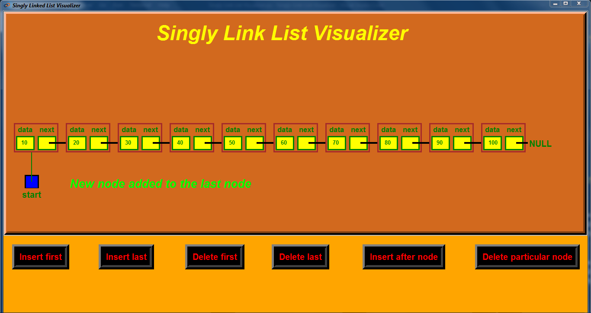

## 
    ***_Introducing My New Project Singly Link List Visualizer_*** 

## 
  ***_Made with Python Tkinter_***  

## 💡 ***_Functionality Provided Here:-_***
- ### ***_Insert node at first_***
- ### ***_Insert node at last_***
- ### ***_Delete node from first_***
- ### ***_Delete node from last_***
- ### ***_Insert a node after a particular node_***
- ### ***_Delete a particular node_***

---
## 🎯 ***_Useful Links:-_***

- ### ***_[Click Here To See the Project Video](https://youtu.be/Tv2Pba1dwNY)_***
- ### ***_[Connect With Me on LinkedIn to Get Regular Project Updates](https://www.linkedin.com/in/samarpan-dasgupta-4aa1061b0/ "LCO")_***
